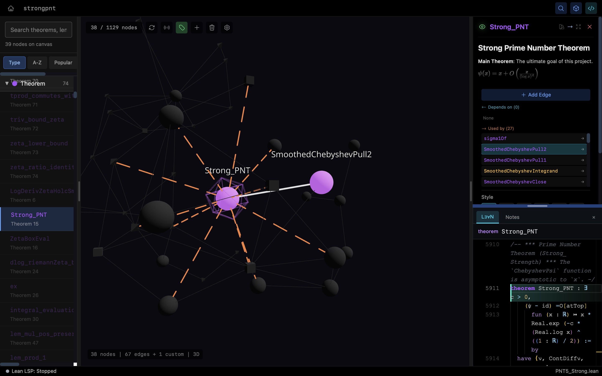

# Astrolabe

**Astrolabe is a growing open-source project that turns our collective vision for the future of mathematical interaction into reality. It belongs to everyone.**

[](https://astrolean.io)
[](https://www.youtube.com/watch?v=WJrw47W3OG0&list=PLSsZwlCw9byduhRCHDBPe1gt4WH46aixb)

## Mission

We're creating opportunities for mathematicians, formalizers, developers, artists, philosophers of technology, and anyone curious about the future of mathematics — to explore what mathematical collaboration looks like in the age of AI, and to make formalization more accessible, enjoyable, and creative.

This includes:
- Customizable frameworks for new modes of mathematical activity
- AI-assisted reasoning and automated formalization
- Dynamic knowledge graphs generated from mathematical papers
- New interaction paradigms that spark broader interest in formal mathematics

## Contributing

To achieve this, we need everyone's contribution. Use AI-assisted coding to bring your ideas to life — we'll coordinate the engineering team to help implement and integrate them.

Not sure where to start? Just feed this entire README to your favorite AI and ask it to help you contribute.

Open an issue or submit a PR.

---

## What is Astrolabe?

<p align="center">
  
</p>

Astrolabe transforms your Lean 4 codebase into an explorable 3D universe. It parses theorems, lemmas, definitions, and their dependencies, presenting them as an interactive force-directed graph.

**Current features:** 3D visualization, dependency exploration, search & filtering, canvas management, code editor, markdown notes.

**Coming soon:** AI integration, LSP diagnostics, 2D view, more interaction modes.

## Templates

Get started quickly with pre-configured Astrolabe templates:

| Template | Description |
|----------|-------------|
| [Strong PNT](https://github.com/Xinze-Li-Bryan/astrolabe-template-strongpnt) | Strong Prime Number Theorem (25k+ lines, 1.1k theorems) |
| [Sphere Eversion](https://github.com/Xinze-Li-Bryan/astrolabe-template-sphere-eversion) | Proof of sphere eversion existence |
| [Ramanujan-Nagell](https://github.com/Xinze-Li-Bryan/astrolabe-template-ramanujan-nagell) | Ramanujan-Nagell theorem formalization |

## Why Astrolabe?

Lean 4 projects grow into thousands of interconnected theorems. Astrolabe parses your project, visualizes the dependency graph in 3D, and lets you explore it interactively—zoom, filter, trace paths, and understand structure at a glance.

## Features

### 3D Force-Directed Graph
- **Physics-Based Layout** — Nodes naturally organize by their connections
- **Namespace Clustering** — Group nodes by Lean namespace with adjustable compactness and separation
- **Density-Adaptive Springs** — High-degree hub nodes get longer edges to prevent star-shaped clustering
- **Interactive Camera** — Orbit, zoom, pan; auto-focus on selected nodes
- **Geometric Node Shapes** — Theorems (spheres), lemmas (tetrahedrons), definitions (boxes), axioms (icosahedrons)
- **Multiple Edge Styles** — Solid, dashed, dotted, polyline, spring, wavy, zigzag

### Graph Simplification
- **Transitive Reduction** — Hide redundant edges (if A→B→C exists, hide A→C)
- **Hide Technical** — Filter out internal/technical declarations
- **Hide Orphaned** — Remove nodes with no connections

### Lean Integration
- **Auto-Parsing** — Reads `.ilean` compilation cache for fast extraction
- **File Watching** — Automatic updates when you edit `.lean` files
- **Sorry Detection** — Scans source for incomplete proofs

### Search & Navigation
- **Fuzzy Search** — Find declarations by name
- **Namespace Browser** — Hierarchical A-Z → Namespace → Type grouping with depth selector
- **Popularity Mode** — Browse by usage count (Hot/Common/Rare/Unused)
- **Dependency Explorer** — View what a theorem uses and what uses it
- **Auto-Expand** — Click a node on canvas to jump to it in the search panel

### Canvas Management
- **Focused Subgraphs** — Display only the nodes you care about
- **Virtual Nodes** — Plan future theorems before implementing them
- **Position Persistence** — Save 3D layouts and camera angles
- **Node Pinning** — Lock nodes in place

### Code & Notes
- **Monaco Editor** — Lean 4 syntax highlighting
- **Markdown Notes** — Per-node documentation with KaTeX math support

## Tech Stack

| Layer | Technology |
|-------|------------|
| Frontend | Next.js 14, React 18, TypeScript |
| Styling | Tailwind CSS |
| State | Zustand |
| 3D Rendering | Three.js, @react-three/fiber, @react-three/drei |
| Graph Layout | Graphology, ForceAtlas2 |
| Code Editor | Monaco Editor |
| Math/Markdown | KaTeX, react-markdown, remark-gfm, rehype-katex |
| Desktop | Tauri 2 (Rust) |
| Backend | Python 3.11+, FastAPI, Uvicorn |
| File Watching | watchfiles |

## Installation

### Requirements

- Node.js >= 18
- Python >= 3.11
- Rust (for Tauri)
- Lean 4 / Elan (for the projects you want to visualize)

### Setup

```bash
# Clone repository
git clone https://github.com/Xinze-Li-Bryan/Astrolabe.git
cd Astrolabe

# Install frontend dependencies
npm install

# Install backend dependencies
cd backend && pip install -e ".[dev]" && cd ..
```

## Usage

### Development Mode

```bash
# Launch frontend + backend together
npm run dev:all

# Or run separately:
npm run backend   # Terminal 1: Backend at http://127.0.0.1:8765
npm run dev       # Terminal 2: Frontend at http://localhost:3000
```

### Building Desktop App

```bash
# 1. Build the Python backend as standalone binary
./scripts/build-backend.sh

# 2. Build the Tauri desktop application
npm run tauri build
```

The backend is bundled as a sidecar binary using PyInstaller. This means:
- End users don't need Python installed
- The app starts the backend automatically
- Everything is contained in a single application bundle

### Testing

```bash
npm run test            # Frontend tests (Vitest)
cd backend && pytest    # Backend tests
```

## Project Structure

```
astrolabe/
├── src/                          # Frontend (Next.js)
│   ├── app/
│   │   ├── page.tsx              # Landing page
│   │   └── local/edit/           # Main editor page
│   ├── components/
│   │   ├── graph3d/              # 3D visualization
│   │   │   ├── ForceGraph3D.tsx  # Main graph container
│   │   │   ├── ForceLayout.tsx   # Physics simulation
│   │   │   ├── Node3D.tsx        # Node rendering
│   │   │   ├── Edge3D.tsx        # Edge rendering
│   │   │   └── effects/          # StatusRing, FlowPulse
│   │   ├── SearchPanel.tsx       # Search & namespace browser
│   │   ├── MonacoLeanEditor.tsx  # Code editor
│   │   ├── LeanCodePanel.tsx     # Code panel wrapper
│   │   └── MarkdownRenderer.tsx  # Notes with math
│   ├── hooks/                    # useGraphData, useFileWatch, useProject
│   ├── lib/
│   │   ├── graphProcessing.ts    # Transitive reduction, clustering, filtering
│   │   ├── canvasStore.ts        # Canvas state management
│   │   └── store.ts              # Global state
│   └── types/                    # TypeScript types
│
├── backend/astrolabe/            # Backend (FastAPI)
│   ├── server.py                 # API endpoints
│   ├── project.py                # Project management
│   ├── graph_cache.py            # Declaration cache
│   ├── canvas.py                 # Canvas state management
│   ├── unified_storage.py        # Metadata storage
│   ├── watcher.py                # File watching
│   ├── parsers/                  # .ilean parsing
│   └── models/                   # Data models (Node, Edge, State)
│
├── src-tauri/                    # Desktop app (Tauri)
│   ├── src/lib.rs                # Sidecar management
│   ├── tauri.conf.json           # Tauri configuration
│   └── binaries/                 # Packaged backend binary
│
└── scripts/
    └── build-backend.sh          # PyInstaller build script
```

## Data Storage

Astrolabe stores project-specific data in `.astrolabe/` within each Lean project:

| File | Content |
|------|---------|
| `meta.json` | Node/edge customizations, notes, virtual nodes |
| `graph.json` | Parsed declaration cache |

## API Reference

| Endpoint | Method | Description |
|----------|--------|-------------|
| `/api/project/load` | POST | Load and parse Lean project |
| `/api/project/search` | GET | Search declarations |
| `/api/project/node/{id}` | GET | Get node details |
| `/api/project/node/{id}/meta` | PATCH | Update node metadata |
| `/api/canvas` | GET/POST | Load/save canvas state |
| `/api/read-file` | POST | Read file content |
| `/ws/watch` | WebSocket | File change notifications |

## Keyboard Shortcuts

| Shortcut | Action |
|----------|--------|
| `Ctrl/Cmd + F` | Focus search |
| `Escape` | Close panels |
| Mouse drag | Rotate camera |
| Scroll | Zoom |
| Right-click drag | Pan |

## Contributors

Thanks to all contributors who help make Astrolabe better!

## License

This project is licensed under the Apache License 2.0 - see the [LICENSE](LICENSE) file for details.
